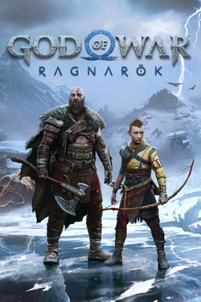
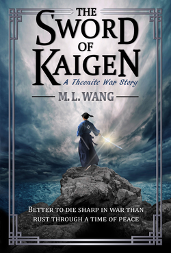
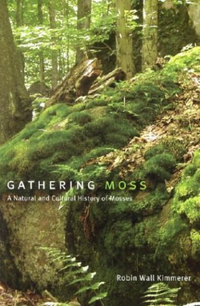

# In and Out
- 📤 Out
	- Polyester
	- Viewing myself as a burden.
	- Doing things out of a sense of obligation instead of utility and joy
	- Cupcakes. They just aren't good. Brownies are better.
	- Trying to smoke meat on a charcoal grill
- 📥 In
	- Things made of wool, wood, and leather
	- Viewing myself as a benefit
	- Writing
	- Fit pics 📸
	- Hats
	- Books outside of sci-fi and fantasy
	- Caspar David Friedrich. His works satisfy my desire for "little guy next to big things", landscapes, and fog.
- Never left
	- Quality over quantity
	- Elevated essentials
	- Big jackets
	- Tasty food
	- Dark chocolate
	- Being a dad
	- Following Jesus intentionally
# Recommendations

_God of War Ragnarök_ is a big, cinematic game about punching things and being a father. What's not to like? I really enjoyed the beautiful visuals, the weightiness of the combat, and the wide variety of enemies (which was an issue I had with the first game).

In _The Sword of Kaigen_ by M.L. Wang, a society of elite warriors navigate generational trauma, misinformation, isolation, and duty. It was a kind of story (about family relationships from the multiple simultaneous view points) and I enjoyed how the fantastical fictional aspects created something that we all can related to even though we can't control individual water molecules and air pressure.

_Gathering Moss_ by Robin Wall Kimmerer is about… moss. It's about moss, but in a cozy and sometimes-philosophical way.

[Astropilot](https://astropilot.bandcamp.com/) is an electronic ambient artist. I listen to his stuff while working and it pairs perfectly with rain sounds. His music makes me feel futuristic and peaceful. 
# By the numbers
- [58 and 26,855 pages read](https://www.goodreads.com/user/year_in_books/2024/50581556)
- [39,776 minutes of (personal) music listened to](https://open.spotify.com/wrapped/share/share-0b61bb94b62a4a64b6127bf2dea3c349?si=AXa5zKLWS6WfDWsYdXGdNg&feature=wrapped&destination=datastories&lang=en)
- Video games: 21,624 minutes played
	- [Steam: 13,104 minutes](https://s.team/y24/frvjmwn?l=english)
	- [Playstation: 6,360 minutes](https://wrapup.playstation.com/api/share-card/?id=8f21dc00a79baefe547a349961b81325e54817ac126d3f57bc56390aa7ccdb76&locale=en-us&handle=LiterallyACar&avatar=https%3A%2F%2Fimage.api.np.km.playstation.net%2Fimages%2F%3Fformat%3Dpng%26w%3D160%26h%3D160%26image%3Dhttps%253A%252F%252Fimage.api.playstation.com%252Fprofile%252Fimages%252Ffilestore%252Fb5b41197%252F5515738883976572657%252F1704081055660.png%26sign%3D9f1b9a2a44441350ad05f66158c426b7ea43e937)
	- Nintendo: 2,160 minutes