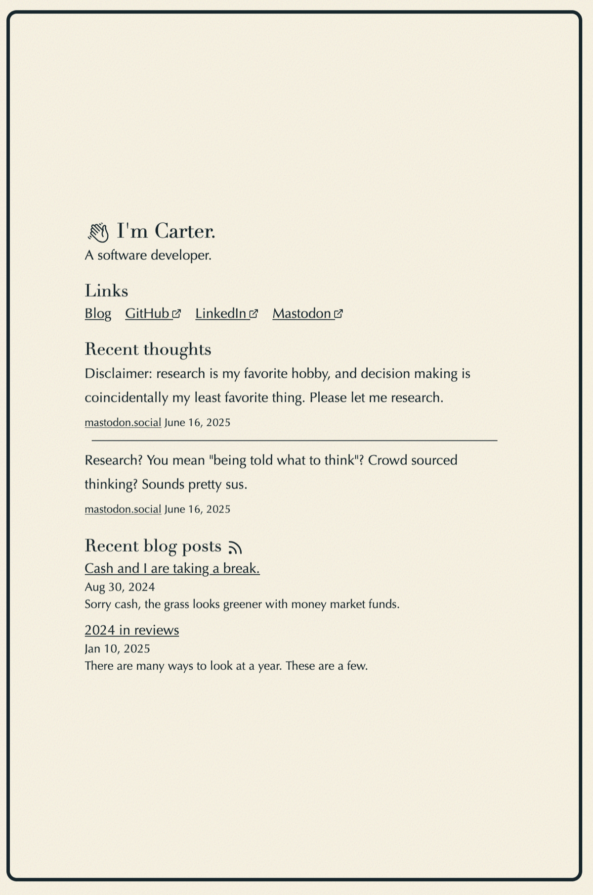

I find that the urge to change the design of my site happens pretty frequently. That's probably a good thing—sense and fashion change. The biggest issue (maybe) is infrastructure. The 2024 version of this site was built on [Tailwind](https://tailwindcss.com/). However, I've always been enamored with the [CSS Zen Garden](https://www.csszengarden.com/)—it has the ability to change the design of a site without changing the HTML.

But Tailwind doesn't make it easy to rip the CSS out of the HTML. It's all "component separation" and "utility classes" instead of the "styling" vs "content" separation of the Zen Garden. 

I still like the sepia tones of [Ethan Schoonover's Solarized](https://ethanschoonover.com/solarized/) and [Kepano's Flexoki](https://stephango.com/flexoki). Most of the changes this year came from "how do I rip out Tailwind and keep semantic HTML?"

Here's the result, as of writing-time:

It's mostly the same. Same noise from Arc, same sepia tones. It uses [Richard9394's MingCute icons](https://github.com/Richard9394/MingCute) I like the spacing of 2024, but I couldn't figure out how to do it while minimizing the separation between styling and content. I was inspired by [the HUG CSS approach](https://gomakethings.com/hug-css-how-i-approach-css-architecture/) and [Simon Willison's long-running weblog](https://simonwillison.net/). It also makes heavy use of [Andy Bell's "favorite 3 lines of CSS"](https://piccalil.li/blog/my-favourite-3-lines-of-css/)

If you have any suggestions, either [leave a Github issue](https://github.com/carterworks/site/issues) or email me. Make sure to mark it "OK to print."
