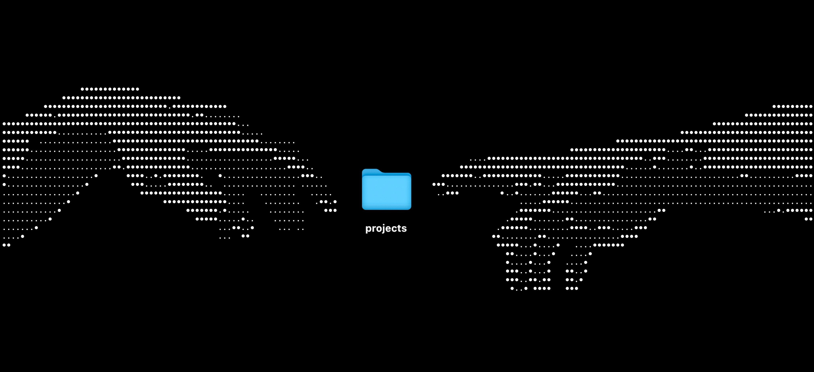

I am devoting a section of my site to "experiments"—little "what if's" and prototypes of ideas. They aren't big enough to turn into apps or tools, nor do I want to spend the time to fully integrate them into my main site. They are independent, atomic, and fun. The point is to be non-committal and give me a chance to try out new things then throw them away. You can see them all [on my Experiments page](/experiements).

---

Back in February, [OpenAI used a halftone image as part of their Super Bowl ad for ChatGPT](https://youtu.be/kIhb5pEo_j0?si=ExVY5auwqqLK2Lze).

Ever since then, I've kind of been obsessed with the visual style. I love things that start as something that are deeply constrained, become beautiful, then continue to hold onto those constraints even though the reasons for them have long since been left behind. Caesar salad was created "by Caesar Cardini at Caesar's in Tijuana, Mexico, when the kitchen was overwhelmed and short on ingredients" (<cite>[Wikipedia](https://en.wikipedia.org/wiki/Caesar_salad)</cite>). Italian peasants starting putting toppings on flat breads while they baked because they would puff up too much in the oven. Halftone and dot matrix printing practices were developed to put words and images on paper in a world before modern bitmaps.

Some of my other favorite examples:

From the Private mode new tab page of Perplexity's Comet

[From designer Sam Peitz](https://x.com/samdape/status/1859945404806451494/photo/1)

A bad heart in a box, by me.

In that vein, [I built a little tool to create them](/experiments/halftone-painting). I might refine it later. I'm not an artist, so I don't have any examples of my own creations. You can save them as pngs. Send them to me with the `@carter.works` halftone address! Make sure to mark it "fit to print"!

