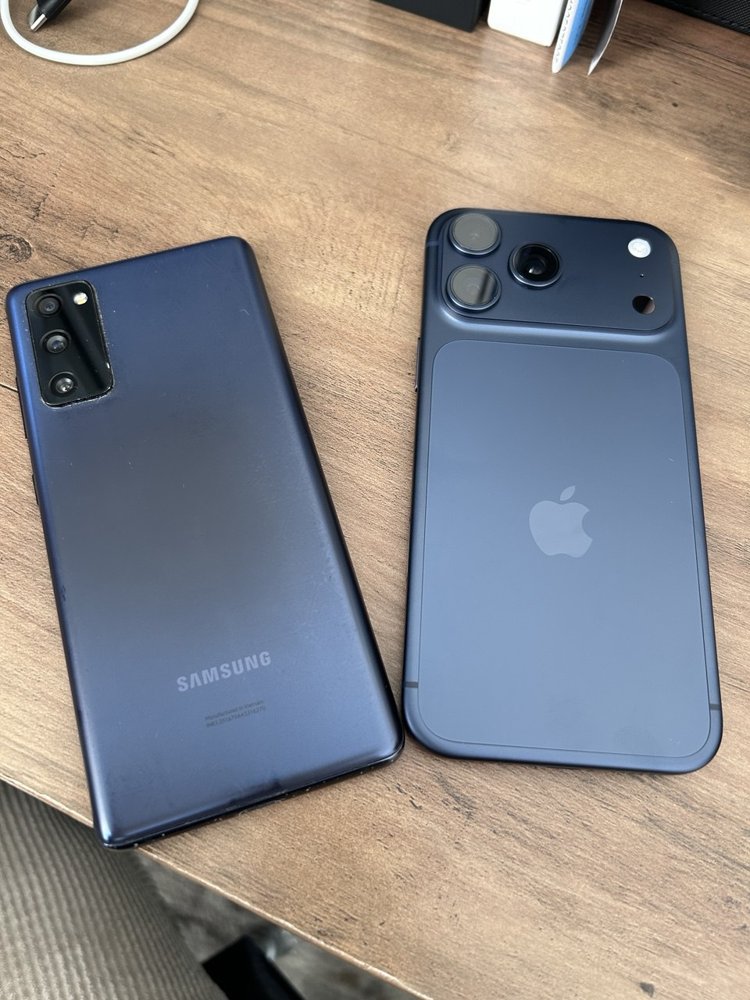

I've always loved Android and Google. Even before I had a smartphone, I downloaded Android Studio onto the family computer just so I could run the emulator. I thought [Randall Monroe's random 2010 blog post about Android bugs he encountered](https://blog.xkcd.com/2010/02/08/android-bug-reports-songs-rovers/) was bizarre—how could the company that is not evil produce anything less than perfect? For the past 10 years and from the first smartphone, they have all been Android. A few budget Samsungs, a Nexus 5, and an LG G6 (the 2:1 aspect ratio was fantastic) were all important and beloved parts of my life. I enjoyed flexing my script kiddie muscles and downloading custom ROMs and tweaking everything to be the most efficient and most custom.

But my first iPhone arrived yesterday-a blue iPhone 17 Pro Max. I've migrated everything over and my Samsung S20 FE has been boxed up to be courtesy-recycled. It's been 24 hours and I've enjoyed setting things up and diving deep into the iOS ecosystem.

## Reasons for wanting to switch

I first started thinking about switching after watching the 2024 WWDC keynote. You know, the one that told you that Apple was going to collect all the context of your life from messages and mail and calendar then give you the ability to ask longitudinal questions about it through ✨Apple Intelligence✨? And the whole thing would be run privately by Apple, the privacy company? Amazing!

...

Anyways, as I thought more about it over the past year, the Apple ecosystem seemed more and more attractive. I'm a little older now and, while I am still a script kiddie who with a computer science degree and a software job, I also have a wife and kids. My hobby time is much diminished and I need my phone to act as a phone. A phone needed to be a phone (and camera, and note pad, and conduit of information) when it was needed.

Additionally, my wife has an iPhone and an iPad. A unified family platform would be nice, for managing screen time for kids (in the future) and for Airtags. I know that Google also has a Find My network, but [it is _opt. in._](https://www.theverge.com/google/655319/google-find-my-device-smart-tag-network-one-year-later) (kinda). The utility of Find My requires a proliferation of participant devices, and Google just didn't have the quality network as of right now.

And I gotta say, for all its haters, liquid glass can be beautiful.

Look at the chromatic aberration on the edges of the notification shade! The edge distortion! And have you seen the airdrop animation?

Meanwhile, Google made some different shapes, like a sawtooth clock. How funky of them.

<video autoplay disablepictureinpicture playsinline loop muted width="300px">
  <source src="/assets/airdrop.webm" type="video/webm"/>
  <source src="/assets/airdrop.mp4" type="video/mp4"/>
</video>

Now the day is finally here. To be fair, this is not an apples-to-apples comparison. This is comparing a 5-year old [Samsung Galaxy S20 FE](https://www.gsmarena.com/samsung_galaxy_s20_fe_5g-10377.php) to the iPhone 17 Pro Max, [a device with literally triple the Geekbench score, twice the RAM, and a screen that isn't cracked.](https://www.gsmarena.com/apple_iphone_17_pro_max-13964.php)

## Things I like about iOS

I think my favorite thing so far about iOS is the quality of first party apps. Maps, Mail, Podcasts, Facetime, Messages, Wallet, and Safari have all be incredible.

- Bottom navigation does not exist on Chrome for Android. Gmail (yes, the first party mail app on Android is tied to a specific service) doesn't support non-Gmail accounts.
- RCS support on Google Messages was flaky and I would regularly have to fallback to SMS/MMS, and I'm not talking green bubble vs. blue bubble. Just green bubble SMS and vanilla RCS have worked great and reliably on iOS.
- The reliability of Samsung Wallet was... not great. Part of this was that the NFC sensor was in the middle of the phone vs on the top on the iPhone. Another part was that the S20 FE was one of the last phones with magnetic stripe transmitting and the decisions between which to use took time. Apple Wallet, on the other hand, is instant.

And the best first party app is **SHORTCUTS**. Android hasn't had an equivalent since the heyday of [Tasker](https://tasker.joaoapps.com/), and it's integrated into the iOS. No-code automation of almost anything in OS works really, really well. I've written a few so far for little things, like toggling auto-rotation when opening media apps or turning off the always-on display when I start working from home.

FaceID works very smoothly. Phones are so tall (yes, I realize that I opted into a large phone) but shifting my thumb from the middle of the screen down to the bottom to scan a fingerprint to open my password manager again took some gymnastics.

Camera Control is very cool. Swiping my finger left and right as well as the half-press to lock AE/AF is very intuitive and reminds me of classic point-and-shoot

## Things I do not miss about Android

This is more of a diss on Samsung than on Android as a whole, but wow does the Samsung app ecosystem disappoint. People gripe about how the Microsoft Store on Windows is full of shovelware and scams, but those people have never visited the Samsung App Store. Please, never purchase a third-party app from this place.

Samsung third party apps are disappointing and filled with advertisements for other Samsung services and "Samsung selected partners". For example, Wallet has an a persistent ad for Samsung Money by SoFi. If you dismiss it, it will come back in a few days. It will give you push notifications for special offers. People who already own Samsung devices were not surprised when the company announced that [the company would bring ads to the giant screens on expensive their moderately-priced fridges](https://www.theverge.com/news/780757/samsung-brings-ads-to-us-fridges.)

The overall user interface presented by One UI 5.1 on Android 13 was fairly inconsistent in presentation and in performance. Again, this may be a factor of comparing a 5-year old budget phone to a brand new flagship, but the iPhone has not dropped a frame yet. Animations stutter not, no matter how much I futz with them. Meanwhile, it was _impossible_ to quick-switch (aka a "slide to the right" on the app bar) between apps. It would flash on the screen, then disappear.

## Things I miss about Android

Honestly, not as much as I thought I was going to! I thought I was going to miss Syncthing as a way of syncing my Obsidian vault around, but [Möbius Sync](https://mobiussync.com/) works really well.

<video autoplay disablepictureinpicture playsinline loop muted width="300px">
  <source src="/assets/niagara.avif" type="video/avif"/>
  <source src="/assets/niagara.webm" type="video/webm"/>
  <source src="/assets/niagara.mp4" type="video/mp4"/>
</video>

[Niagara Launcher](https://niagaralauncher.com/) will be greatly missed. The scrollable alphabet feature that moved out of the way of your thumb is so fast. I'm surprised that Apple still keeps around the old alphabet quick list for the App Library.

Gboard on Android is great. The number row on top makes it really quick to... type numbers. And why is the emoji keyboard on iOS still a completely separate input language? If I want to 👏talk👏 👏like👏an👏AI,👏 it shouldn't take me five minutes.

Why are iOS emoji so ugly? They haven't been updated since they were first introduced in iOS 2.2! The gradient and outline look very dated, compared to Noto Color Emoji.

[F-Droid](https://f-droid.org/en/packages/), an app marketplace for open-source applications, was nice. I would often use it for little apps because I knew that, when I downloaded an app via F-Droid, it would not be displaying advertisements or slurping up my data and sending it to Facebook or the Chinese Communist Party.

## TL;DR

Man discovers that:

1. a new phone that costs $1,274.39 today has better battery life and software performance than a phone he bought for $643.49 five years ago,
2. after completing [a course on animations](https://animations.dev) he really like pretty animations, and
3. Changing a decade of habits has a few bumps.
