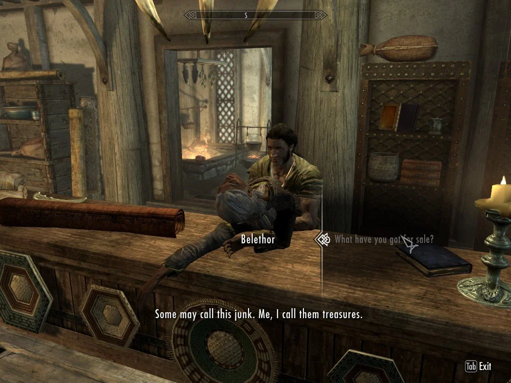
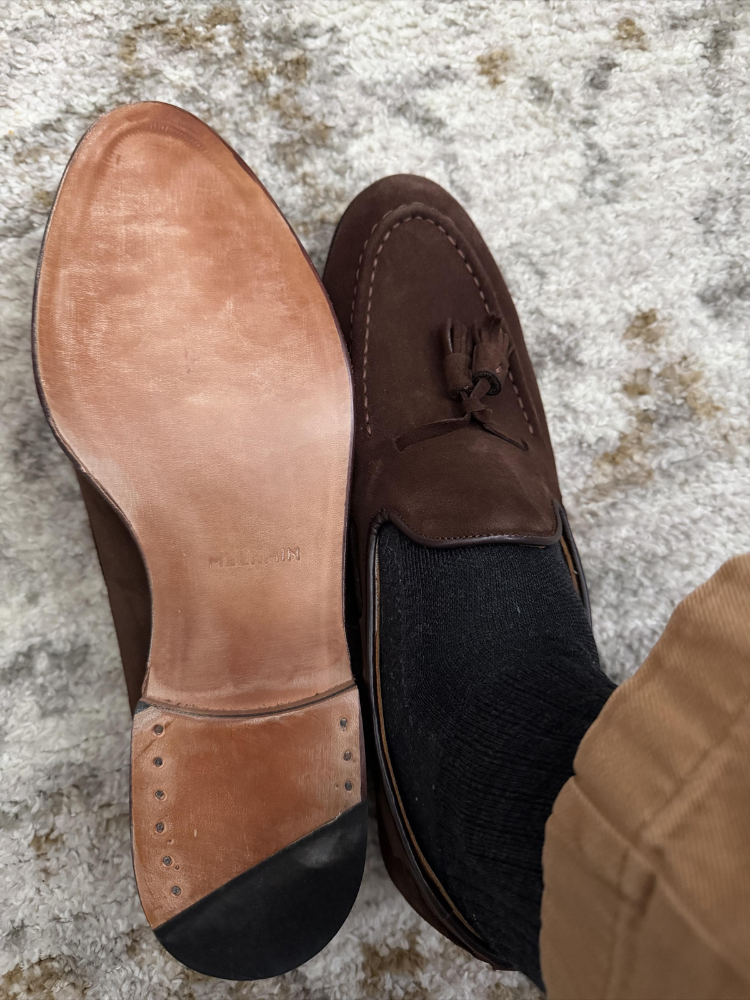

My friends and I decided to do a weekly blog challenge for the month of April, 2026! Each week, one of us chooses a prompt and we all write posts.

For week 1, Sam chose the prompt:  
**"What's something cool I'm caring about or into recently?"**

* [Sam: "Four Key Book Arts and Project Hail Andy"](https://samwarnick.com/blog/four-keys-book-arts-and-project-hail-andy/)
* [Jared: "The Nature of Prototyping in Professional Development"](https://jaredezz.tech/posts/the-nature-of-prototyping)
* [Dave: "Nintendo announces 3DS successor ‘3DS Plus’"](https://catskull.net/nintendo-announces-3ds-successor-3ds-plus.html)

---

The first draft was a diatribe about how guilt and low self-confidence eat away at my sense of self. But... four minutes before my scheduled "finish the draft" time, I heard ["Disco Snail" by Vulfmon](https://open.spotify.com/track/0yin14PPCxLBorpVqlON8V?si=f49c797d4f914fae). So consider listening to my current favorite song while reading me complain about myself.

---

> “I used to do drugs. I still do, but I used to, too.”  

Mitch Hedberg

In that same vein, I used to be a person of low self-confidence. I still am, but I used to, too. This manifests itself in a lot of non-obvious ways. Every sentence requires hedging or well-researched primary sources and hard data. Every evening spent in leisure is accompanied by a side of guilt because the time could be better spent on others or fixing the three holes I made in the drywall during Christmas 2024. Guilt eats away to the point where I don't know what my real interests are.
The antidote is doing the opposite: having opinions, avoiding hedging, and being "unapologetically myself". That doesn't mean being a jerk, it just means accepting what I like without apologizing. This resolution to abandon self-apologetics has been going on for a few weeks. I like it! It feels good! I still feel embarrassed saying "_Mission: Impossible - Fallout_ is my current favorite movie. No I can't intelligently articulate why. But Henry Cavill is very cool. Yeah, it is silly [when he cocks his arms and grows a pocket and a beard before punching](https://youtu.be/obpzIPd6RSg)." It's hard to say "I know Elden Ring received wide critical acclaim. Brandon Sanderson called it his favorite game. But I don't like it. I don't have the time to walk back to the Fallingstar Beast again. I don't want to watch another YouTube video on how to optimize my build." Just because everyone else likes it doesn't mean I have to like it. Just because everyone else dislikes it doesn't mean that I have to like it, and I don't like Elden Ring.

---

> In a world of scarcity, we treasure _tools_.  
> In a world of abundance, we treasure _taste_.

[Anu Atluru, _Taste is Eating Silicon Valley_](https://www.workingtheorys.com/p/taste-is-eating-silicon-valley)

"The importance of taste" is a current topic in Silicon Valley. "The age of SaaS is over; now is the day of personal software through vibecoding," they say. I don't know if that is right, and I certainly have no control over the answer. But one way to think about what happened to software is to think about what happened to clothing. Machines came to textile manufacturing and then clothing went from being a long and laborious process to a quick one. Before, only the wealthy could afford more than a few outfits. Now, the world is flooded by cheap and shoddy clothing. For example, [one article counted 369,264 separate products available for sale](https://www.per-spex.com/articles/2023/9/12/shein) through Chinese clothing retailer Shein on a random day in October 2021. They also report that the parent company, Zoetop, produces 1.2 million articles of clothing _a day_.

Maybe the world will fill with slop. Maybe the world is already full of slop. Whenever that happens, you should focus on the things that bring _you_ joy. I'm starting to do that now. I'm playing through _Assassin's Creed Origins_ again, even though it only has a 7.3 user score on Metacritic. I've decided I don't want to finish reading _The Day of the Jackal_ even though I told myself I needed to read the book before watching the TV show. My wife thinks Eddie Redmayne is cute and watching it will bring _her_ joy, which brings me joy. 

I'm enjoying having opinions.

Wise words, Belethor

---

Oh and also I'm enjoying these [suede loafers from Meermin](https://meermin.com/products/101381-brown-suede-e). They slap.
