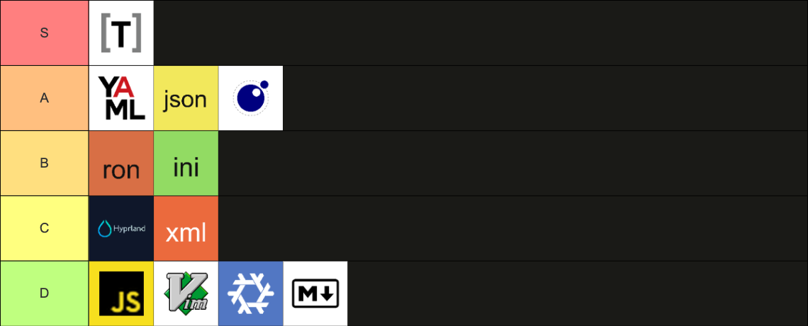

My friends and I decided to do a weekly blog challenge for the month of April 2026! Each week, one of us chooses a prompt and we all write posts.

For week 3, Dave chose the prompt:
**“How do you compute? (Explain what computers you use, ones you used to use, software you use, just whatever you think answers the question)”**

- [Sam: “How Do I Computer”](https://samwarnick.com/blog/how-do-i-computer/)
- [Jared: “”](https://jaredezz.tech/posts//)
- [Dave: “”](https://catskull.net/)

---

My general philosophy for computation is rather boring:

1. [File over app](https://stephango.com/file-over-app). I am a minimalist. I get frustrated by cruft. I frequently burn it all down and start from scratch (it has been just two months since I wiped the drive on my PC to install NixOS. I use ~~Arch~~ nix btw). There needs to be an easily auditable way of getting back up to speed with ease. This philosophy has aged pretty well in the era of agentic programming. (BTW check out [my dotfiles](https://github.com/carterworks/dotfiles)).
2. [Don't make me think](https://sensible.com/dont-make-me-think/). When I want to do something, I want to spend my time doing that thing, not [bike shedding](https://en.wikipedia.org/wiki/Law_of_triviality). I don't want to update my app, remember my password, figure out where I stored the document, or spend the first four hours sharpening the axe. Why should I have to three-finger tap to show the copy-paste-select menubar on iOS (there is no discoverability on that feature other than word of mouth). All this is why people still buy video game consoles rather than the ROG Strix Peerless Assassins, featuring the Cachy Kernel with the OpenKANG CPU scheduler. Maybe the levers should be there for those who care, but that's a kind of activity for 1% of people.
---
But other people have already expressed all these ideas so very well. Instead, I will objectively end all discussions on "what file format should I configure my applications in" by ranking them.

I haven't looked at the documentation for most of these. Instead, it is a vibes-based ranking based on how much intuitive sense they make to me, the Emperor of Configuration. Most of my programming experience is in JavaScript. Therefore, the "how easily can I convert this to JSON" vibe weighs heavily on the ranking.

There is a trivial example configuration for each language, centered around a hypothetical music player. However, that example often fails to show the horrors.

## Tom's Obvious Minimal Language (TOML)

```toml
music_library = "/srv/music"
startup_playlist = "morning mix"

[playback]
volume_step = 5
crossfade_seconds = 3
replaygain = "album"
```

Character count: 132
Perfect. No notes. Tippy top of S tier. The indentation is flat, strings are quoted, it supports multiline strings.
## YAML Ain't Markup Language

```yaml
music_library: /srv/music
startup_playlist: morning mix
playback:
  volume_step: 5
  crossfade_seconds: 3
  replaygain: album
```

Character count: 125
yaml is the svelte cousin of JSON. Entire careers have been built on configuring yaml: GitHub Actions, Kubernetes, and others. But I can never shake the feeling that I'm yamling incorrectly. I default to a tab size of 2 spaces so it always unnerves me that the array indicator `-` and the properties of the object in the array line up.

```yaml
- title: Don\'t Stop Believing
  artist: Journey
- title: Faithfully
  artist: Journey
```
Another blight on yaml is the ambiguity. [StackOverflow](https://stackoverflow.com/questions/53648244/specifying-the-string-value-yes-in-yaml) (remember that place?) tells me that yaml 1.1 defines a boolean as:
```regex
y|Y|yes|Yes|YES|n|N|no|No|NO|
true|True|TRUE|false|False|FALSE|
on|On|ON|off|Off|OFF
```
Too much, darling. Later versions of yaml narrow the boolean regex, but it takes a long time to rebuild trust.
Later versions of the specification got rid of that, but it feels like a spooky ghost that follows me. 
However, the trimming of the quotation marks earns it a place above JSON at the very top of A tier.
## JavaScript Object Notation (JSON)

```json
{
  "music_library": "/srv/music",
  "startup_playlist": "morning mix",
  "playback": {
    "volume_step": 5,
    "crossfade_seconds": 3,
    "replaygain": "album"
  }
}
```

Character count: 169
In 2026, it is almost at the point where JSON is to the internet as electricity is to the nervous system. It is the message format that most of the web works on (go away, protobuf. I can't read you with my eyes.) But, I still can't add a comment anywhere. JSON5 and JSONC are fake. It's been 14 years and I still can't `JSON.parse('{ "foo": "bar", })`. It's annoying to have to write the quotes and the commas every single time. It's hard to balance the ubiquitousness and the quirks, so I will put it in A tier.
## Lua

```lua
return {
  music_library = "/srv/music",
  startup_playlist = "morning mix",
  playback = {
    volume_step = 5,
    crossfade_seconds = 3,
    replaygain = "album",
  },
}
```

Character count: 172
Lua gets a special mention because, although it is a programming language and not a static description of a data object, it is often used to configure programs. Most famously in Roblox, Pico8, and Neovim, but also in the next version of Hyprland. That's because the runtime of Lua is teeny and therefore easily embedded inside other applications. I don't hate it. I also don't love it. The similarities between objects and arrays are a little strange, but not absurd. A tier for the versatility.
## Rusty Object Notation (RON)

```ron
(
  music_library: "/srv/music",
  startup_playlist: "morning mix",
  playback: (
    volume_step: 5,
    crossfade_seconds: 3,
    replaygain: "album",
  ),
)
```

Character count: 159

I first learned of RON yesterday while installing System76's Cosmic Desktop. This contrived example looks simple enough, but the way that Cosmic does it is... odd.
```ron
{
    (
        modifiers: [
            Alt,
            Shift,
        ],
        key: "Tab",
    ): Disable,
    (
        modifiers: [
            Ctrl,
        ],
        key: "space",
    ): Spawn("vicinae toggle"),
}
```
Why does it start with a nested object‽ Why do we need an extra level of indentation? What does `()` represent? At first glance, it looks backwards compared to JSON. What does `Disable` even represent? I, genuinely, have no idea how to translate this into any of the other formats. 
For these sins, I give it B tier.
## Ini

```ini
[player]
music_library=/srv/music
startup_playlist=morning mix

[player.playback]
volume_step=5
crossfade_seconds=3
replaygain=album
```

Character count: 132
I haven't used ini a lot in the past 15 years, but I have fond memories of modifying video game settings with Notepad. It looks pretty similar to toml. B tier.
## Hypr

```
$library = /srv/music

player {
  startup_playlist = morning mix

  playback {
    volume_step = 5
    crossfade_seconds = 3
    replaygain = album
  }
}
```

Character count: 153
I think the creator of Hyprland has a history of getting into petty internet squabbles and then forking projects. I'm not going to look up why it was created. I also will not learn why `yes, please :)` is an alias for `true`. I am generally against domain-specific languages (sorry, [Matthew Butterick](https://beautifulracket.com/appendix/why-lop-why-racket.html)). However, Mr. Hyprland Creator is [currently migrating away from Hyprland to Lua](https://github.com/hyprwm/Hyprland/pull/13817) so even he has seen the light against it.
C tier.
 
## XML

```xml
<config>
  <musicLibrary>/srv/music</musicLibrary>
  <startupPlaylist>morning mix</startupPlaylist>
  <playback>
    <volumeStep>5</volumeStep>
    <crossfadeSeconds>3</crossfadeSeconds>
    <replaygain>album</replaygain>
  </playback>
</config>
```

Character count: 245
By far, the most verbose of all of these. The only saving grace is that it is easy to type and that [LLMs seem to interpret it more confidently](https://platform.claude.com/docs/en/build-with-claude/prompt-engineering/claude-prompting-best-practices#structure-prompts-with-xml-tags). I often include pseudo-xml in my prompts, like wrapping documentation from a webpage in `<docs>`. Its crimes are many: XSLT, rigidity (i.e. no fault tolerance), and of course the verbosity. C tier.
## Nix

```nix
{
  musicLibrary = "/srv/music";
  startupPlaylist = "morning mix";
  playback = {
    volumeStep = 5;
    crossfadeSeconds = 3;
    replaygain = "album";
  };
}
```

Character count: 161
Deceitful little Nix. It's actually... a programming language! One that I have used a lot and still don't understand! The following is an example from my dotfiles. See if you can translate this into JavaScript:
```nix
outputs =
    inputs@{ self, nixpkgs, ... }:
    let
      mkSystem = import ./nix/lib/mksystem.nix {
        inherit inputs nixpkgs self;
      };
    in
    {
      packages = nixpkgs.lib.genAttrs [ "aarch64-darwin" "x86_64-linux" ] (
        system:
        let
          pkgs = import nixpkgs { inherit system; };
        in
        {
          dotbot = pkgs.dotbot;
        }
      );

      nixosConfigurations.scylla = mkSystem "scylla" {
        system = "x86_64-linux";
        profile = "carter";
        extraModules = [ inputs.disko.nixosModules.disko ];
      };

      darwinConfigurations."Carters-MacBook-Pro" = mkSystem "carters-macbook-pro" {
        system = "aarch64-darwin";
        profile = "carter";
        systemUsername = "cmcbride";
        darwin = true;
      };

      formatter.aarch64-darwin = nixpkgs.legacyPackages.aarch64-darwin.nixfmt-tree;
      formatter.x86_64-linux = nixpkgs.legacyPackages.x86_64-linux.nixfmt-tree;
    };
```
Tricky, right? I can never remember what `@` means. 
```js
const outputs = (inputs) => {
  const { self, nixpkgs } = inputs;
  const mkSystem = importMkSystem({
    inputs,
    nixpkgs,
    self,
  });

  return {
    packages: Object.fromEntries(
      ["aarch64-darwin", "x86_64-linux"].map((system) => {
        const pkgs = importNixpkgs({ system });
        return [system, { dotbot: pkgs.dotbot }];
      }),
    ),

    nixosConfigurations: {
      scylla: mkSystem("scylla", {
        system: "x86_64-linux",
        profile: "carter",
        extraModules: [inputs.disko.nixosModules.disko],
      }),
    },

    darwinConfigurations: {
      "Carters-MacBook-Pro": mkSystem("carters-macbook-pro", {
        system: "aarch64-darwin",
        profile: "carter",
        systemUsername: "cmcbride",
        darwin: true,
      }),
    },

    formatter: {
      "aarch64-darwin": nixpkgs.legacyPackages["aarch64-darwin"]["nixfmt-tree"],
      "x86_64-linux": nixpkgs.legacyPackages["x86_64-linux"]["nixfmt-tree"],
    },
  };
};
```
I couldn't figure it out, despite having used nix for 2+ years. That snippet right there is AI-generated. 
I am not completely sold on the argument that they needed to create a deterministic, functional programming language without side effects just to be able to create build scripts that always evaluate to the same lock file. But I just write JavaScript, what do I know.

## Vimscript

```vim
let g:player = {
\ 'music_library': '/srv/music',
\ 'startup_playlist': 'morning mix',
\ 'playback': {
\   'volume_step': 5,
\   'crossfade_seconds': 3,
\   'replaygain': 'album',
\ },
\ }
```

Character count: 188
Vimscript is on the list just so I can tell you that I like Lua more than vim. D tier.

## Programming language as configuration

```js
export default {
  musicLibrary: "/srv/music",
  startupPlaylist: "morning mix",
  playback: {
    volumeStep: 5,
    crossfadeSeconds: 3,
    replaygain: "album",
  },
};
```

Character count: 171
I don't want to have to write tests for my configuration files! 2 branches is one too many! D tier.
## Markdown files

```md
# Music player config

- Music library: /srv/music
- Startup playlist: morning mix
- Playback
  - Volume step: 5
  - Crossfade seconds: 3
  - Replaygain: album
```

Character count: 159
aka an `AGENTS.md` or `CLAUDE.md` or `SKILL.md` file. The worst kind of configuration because the output is always different! F tier. 

---
Thank you for coming to my TED Talk. Don't forget to like and subscribe.
